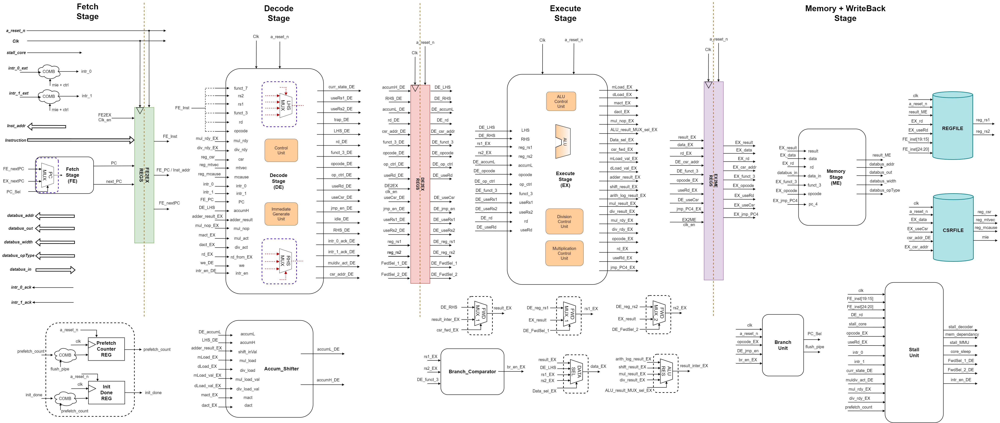

# Dobby RV32IM SoC

Experimental RV32IM ISA core build for the Dobby microcontroller from TU Dresden.

The core is optimized for power consumption and all modules are 
described in Verilog and synthesized using Cadence.

For a detailed description of the project, check out 'dobby_rv32im_report.pdf'.

# RV32IM Core Architecture

